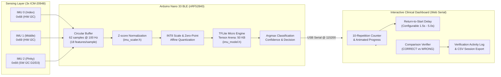
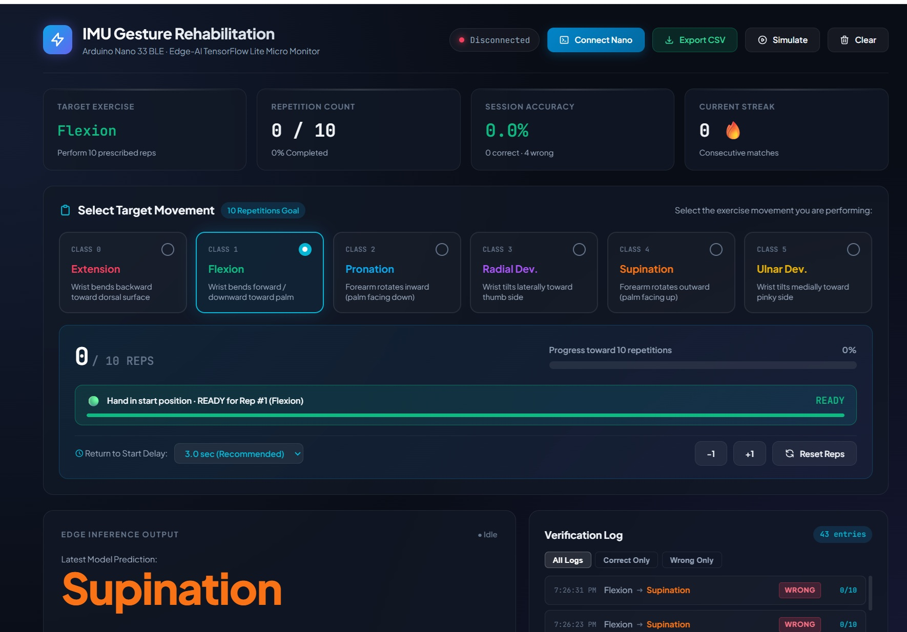
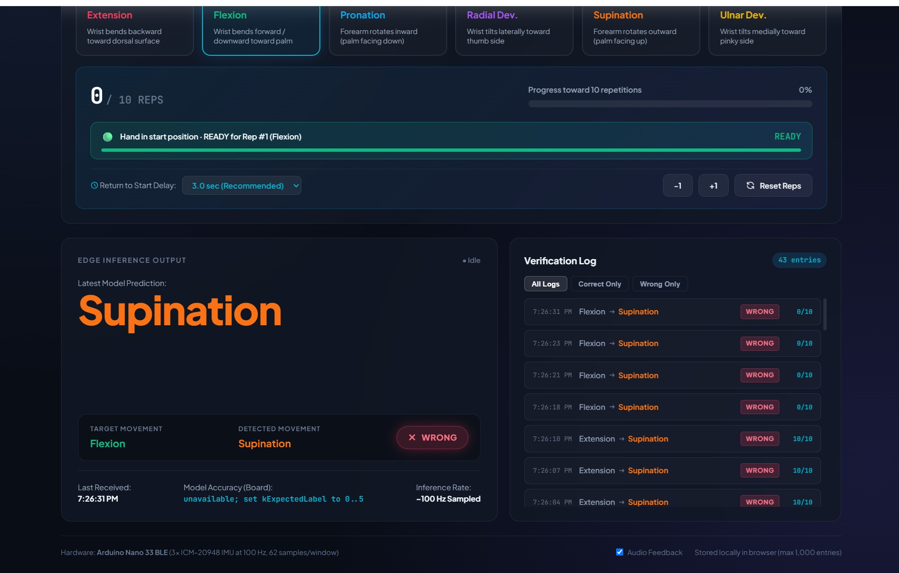
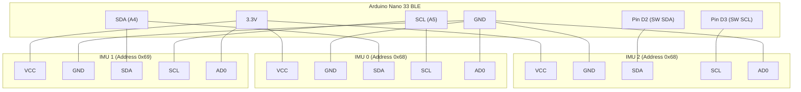

# 🧠 Real-Time 3-IMU Gesture Recognition with TensorFlow Lite Micro

Embedded edge-AI firmware and interactive rehabilitation dashboard for real-time wrist and hand movement classification on the **Arduino Nano 33 BLE / BLE Sense** using **TensorFlow Lite Micro** and three **ICM-20948** 9-DoF Inertial Measurement Units (IMUs).

---

## 📑 Table of Contents

- [Overview](#-overview)
- [Gesture Classes](#-gesture-classes)
- [System Architecture](#-system-architecture)
- [🖥️ Interactive Rehabilitation Dashboard (decision_dashboard.html)](#️-interactive-rehabilitation-dashboard)
  - [Dashboard Overview](#dashboard-overview)
  - [Key UI Capabilities](#key-ui-capabilities)
  - [Telemetry & Comparison Engine](#telemetry--comparison-engine)
  - [Hand-Return Recovery Delay Mechanism](#hand-return-recovery-delay-mechanism)
  - [Clinical CSV Session Export](#clinical-csv-session-export)
  - [Launching the Dashboard](#launching-the-dashboard)
- [Hardware & Wiring](#-hardware--wiring)
  - [I2C Bus Allocation](#i2c-bus-allocation)
  - [Pinout Table](#pinout-table)
  - [Wiring Diagram](#wiring-diagram)
- [Signal Processing & ML Pipeline](#-signal-processing--ml-pipeline)
  - [Input Windowing](#1-input-windowing)
  - [Feature Extraction & Standardization](#2-feature-extraction--standardization)
  - [On-Device INT8 Quantization](#3-on-device-int8-quantization)
  - [Inference & Argmax](#4-inference--argmax)
- [Directory Structure](#-directory-structure)
- [Prerequisites & Dependencies](#-prerequisites--dependencies)
- [Installation & Flashing](#-installation--flashing)
- [Operating Modes & Configuration](#-operating-modes--configuration)
  - [Continuous Live Inference & Return Delay](#1-continuous-live-inference--return-delay-default)
  - [Running Accuracy Benchmarking](#2-running-accuracy-benchmarking)
  - [CSV Streaming for Data Logging](#3-csv-streaming-for-data-logging)
- [Troubleshooting & Diagnostics](#-troubleshooting--diagnostics)
- [License](#-license)

---

## 🚀 Overview

This sketch deploys an optimized 1D/2D Convolutional Neural Network (CNN) directly on the **Nordic nRF52840 ARM Cortex-M4F** microcontroller of the Arduino Nano 33 BLE. The model classifies complex wrist movements relevant to physical therapy and rehabilitation in real time.

### Key Highlights
- **Ultra-low latency**: Zero-cloud edge computing with on-device inference.
- **Dual-Bus Topology**: Solves I2C address collision for 3 identical sensors using hardware I2C alongside a custom bit-banged software I2C driver.
- **Quantized INT8 Execution**: Utilizes ~25.5 KB Flash for model weights and a 50 KB tensor arena in RAM.
- **Clinical Web Serial Dashboard**: Zero-install browser telemetry dashboard with repetition prescription, real-time verification, and CSV export.
- **Robust Normalization**: Integrated on-chip Z-score normalization matching training distributions.

---

## 🎯 Gesture Classes

The model classifies multi-axis sensor patterns into **6 distinct wrist/hand motions**:

| Index | Label | Anatomical Description |
| :---: | :--- | :--- |
| `0` | **Extension** | Bending the wrist backward toward the forearm dorsal surface |
| `1` | **Flexion** | Bending the wrist forward/downward toward the palm |
| `2` | **Pronation** | Rotating forearm/hand inward (palm facing down) |
| `3` | **Radial Deviation** | Tilting wrist laterally toward the thumb |
| `4` | **Supination** | Rotating forearm/hand outward (palm facing up) |
| `5` | **Ulnar Deviation** | Tilting wrist medially toward the little finger |

---

## 🏗️ System Architecture



---

## 🖥️ Interactive Rehabilitation Dashboard

The system includes a state-of-the-art browser application (`decision_dashboard.html`) connecting directly to the Arduino Nano 33 BLE via the **Web Serial API**. It transforms raw ML inference outputs into a structured clinical rehabilitation session.

### Dashboard Overview



### Key UI Capabilities

1. **Target Exercise Prescription (Interactive Radio Cards)**
   * Selectable cards for all 6 rehabilitation gestures (`Extension`, `Flexion`, `Pronation`, `Radial Dev`, `Supination`, `Ulnar Dev`).
   * Each card displays anatomical class indices and color-coded status styling.
   * Selecting a movement automatically resets repetition counts and primes the session for that exercise.

2. **10-Repetition Prescription Goal Tracker**
   * Real-time counter tracking progress towards the prescribed target (`X / 10 REPS`).
   * Smooth animated gradient progress bar ($0\% \rightarrow 100\%$).
   * Celebratory milestone banner upon completing all 10 reps (`🎉 Target Achieved!`).
   * Manual adjustment controls (`+1`, `-1`, and `↺ Reset Reps`) for therapist intervention.

3. **Hand-Return Recovery Delay Mechanism**
   * Configurable recovery delay selector (`1.5s`, `2.5s`, `3.0s` [Default], `4.0s`, `5.0s`).
   * Allows the patient comfortable physical time to return their hand to the resting/neutral starting point between repetitions.
   * **Transition Guard**: While the patient returns to the start position, intermediate sensor transitions are flagged as `⏳ Returning...` without penalizing accuracy or triggering false reps.
   * **Audio & Visual Readiness Signals**: Live countdown timer bar smoothly ticks down; upon reaching zero, a double harmonic audio chime signals readiness for the next rep.

---

### Telemetry & Comparison Engine



* **Dual-View Comparison**: Real-time side-by-side inspection of **Target Movement** vs. **Detected Movement**.
* **Instant Match Pill**:
  * <span style="color:#10b981;font-weight:700;">✓ CORRECT</span> — Glowing emerald green badge with pleasant harmonic chime.
  * <span style="color:#f43f5e;font-weight:700;">✗ WRONG</span> — High-contrast rose badge with low tone feedback.
* **Session Scoreboard**: Real-time calculated session accuracy percentage, total correct vs. wrong detections, and consecutive match streak ($\text{Streak} = N\text{ 🔥}$).
* **Verification Activity Log**: Filterable tabular history of all session events with exact timestamps, target-to-prediction arrows, verification status, and repetition progress markers. Supports `All Logs`, `Correct Only`, and `Wrong Only` filtering.

---

### Clinical CSV Session Export

Clicking the **Export CSV** button in the dashboard toolbar generates an instantly downloadable, standardized report (`IMU_Rehab_Log_YYYY-MM-DD_HH-mm-ss.csv`):

```csv
Timestamp,Target_Movement,Predicted_Movement,Result,Repetition_Count,Board_Accuracy
"19:14:02","Flexion","Flexion","CORRECT","1/10","95.8%"
"19:14:06","Flexion","Flexion","CORRECT","2/10","96.1%"
"19:14:10","Flexion","Extension","WRONG","2/10","94.8%"
```

---

### Launching the Dashboard

1. Start a local HTTP server in the repository root (required for Web Serial security):
   ```powershell
   python -m http.server 8000
   ```
2. Open Google Chrome or Microsoft Edge and navigate to:
   ```text
   http://localhost:8000/decision_dashboard.html
   ```
3. Close the Arduino IDE Serial Monitor.
4. Click **Connect Nano**, select the Arduino COM port at `115200` baud, and select your target exercise!
5. *(Optional)* Click **Simulate** to preview all UI interactions offline without physical hardware.

---

## 🔌 Hardware & Wiring

### I2C Bus Allocation

Each ICM-20948 sensor only has two selectable 7-bit I2C addresses determined by its `AD0` (or `SDO`) pin:
- `AD0` connected to `GND`: `0x68`
- `AD0` connected to `3.3V`: `0x69`

Because three sensors are needed, connecting all three to the same I2C bus causes an address collision. This system solves this without an external multiplexer (like TCA9548A) by splitting them across **two distinct I2C buses**:

1. **Hardware I2C (`Wire`)**: Drives `IMU 0` (`0x68`) and `IMU 1` (`0x69`).
2. **Software Bit-Banged I2C (`BitBangI2C`)**: Drives `IMU 2` (`0x68`) using digital pins `D2` and `D3`.

### Pinout Table

| Sensor | Placement | Bus Type | SDA Pin | SCL Pin | AD0 Pin | I2C Address | Power (VCC / GND) |
| :--- | :--- | :--- | :---: | :---: | :---: | :---: | :--- |
| **IMU 0** | Index Finger / Distal | Hardware I2C | `A4` (SDA) | `A5` (SCL) | `GND` | `0x68` | `3.3V` / `GND` |
| **IMU 1** | Middle Finger / Proximal | Hardware I2C | `A4` (SDA) | `A5` (SCL) | `3.3V` | `0x69` | `3.3V` / `GND` |
| **IMU 2** | Little Finger | Software I2C | `D2` | `D3` | `GND` | `0x68` | `3.3V` / `GND` |

> [!WARNING]
> The Arduino Nano 33 BLE operates exclusively at **3.3V logic levels**. Never connect sensor VCC or I/O pins to 5V!

### Wiring Diagram



---

## 📊 Signal Processing & ML Pipeline

### 1. Input Windowing
- **Sampling Frequency**: $100\text{ Hz}$ ($\Delta t = 10\text{ ms}$).
- **Window Length**: $62\text{ samples}$ ($\approx 620\text{ ms}$).
- **Channels per Sample**: $18\text{ features}$:
  $$\mathbf{x}_t = [\underbrace{a_{0x}, a_{0y}, a_{0z}, g_{0x}, g_{0y}, g_{0z}}_{\text{IMU 0}},\; \underbrace{a_{1x}, a_{1y}, a_{1z}, g_{1x}, g_{1y}, g_{1z}}_{\text{IMU 1}},\; \underbrace{a_{2x}, a_{2y}, a_{2z}, g_{2x}, g_{2y}, g_{2z}}_{\text{IMU 2}}]$$
- Raw 16-bit accelerometer readings are scaled to units of $g$ ($\pm 2g \implies \div 16384.0$).
- Raw 16-bit gyroscope readings are scaled to $^\circ/\text{s}$ ($\pm 250^\circ/\text{s} \implies \div 131.0$).

### 2. Feature Extraction & Standardization
Each of the 18 channels is normalized using training set statistics stored in `imu_scaler.h`:
$$z_{t, i} = \frac{x_{t, i} - \mu_i}{\sigma_i}$$
where $\mu_i$ is `feature_means[i]` and $\sigma_i$ is `feature_scales[i]`.

### 3. On-Device INT8 Quantization
Normalized floating-point inputs are quantized into the model's INT8 input tensor:
$$q_{t, i} = \text{clip}\left(\left\lfloor \frac{z_{t, i}}{S_{\text{in}}} \right\rceil + Z_{\text{in}},\; -128,\; 127\right)$$
where $S_{\text{in}}$ (`input->params.scale`) and $Z_{\text{in}}$ (`input->params.zero_point`) are queried at runtime directly from the model tensor schema.

### 4. Inference & Argmax
- TensorFlow Lite Micro invokes the quantized CNN graph via `interpreter->Invoke()`.
- The output tensor produces 6 INT8 activation scores.
- An argmax reduction extracts the class with the highest probability:
  $$\hat{y} = \arg\max_{c \in [0..5]} (\text{output}[c])$$

---

## 📁 Directory Structure

```text
Nano33_CNN_Deployment/
├── docs/
│   └── images/
│       ├── dashboard_overview.jpg         # Full UI dashboard screenshot
│       └── dashboard_rehab_telemetry.jpg   # Close-up telemetry & comparison screenshot
├── Nano33_CNN_Deployment.ino                    # Main Arduino firmware: I2C drivers, inference loop, reporting
├── imu_model.h                            # C array (imu_model_data) representing the INT8 TFLite model
├── imu_scaler.h                           # Feature standardization parameters (feature_means, feature_scales)
└── README.md                              # Project documentation (this file)
```

---

## 📦 Prerequisites & Dependencies

### Hardware
- **1x Arduino Nano 33 BLE** (or BLE Sense)
- **3x ICM-20948** 9-DOF IMU sensor breakout boards
- Jumper wires and breadboard / custom PCB
- Micro-USB data cable

### Software & Libraries
1. **Arduino IDE 2.x** (or Arduino CLI).
2. **Arduino Mbed OS Nano Boards** package:
   - In Arduino IDE: `Tools` > `Board` > `Boards Manager...` > Search `Arduino Mbed OS Nano Boards` and install.
3. **Arduino_TensorFlowLite** library (v2.4.0-ALPHA or compatible):
   - In Arduino IDE: `Tools` > `Manage Libraries...` > Search `Arduino_TensorFlowLite`.

---

## 🛠️ Installation & Flashing

1. **Clone or download the repository:**
   ```bash
   git clone https://github.com/hidayatkhan013/MultiSensor_Hands_rehab_model_deployment.git
   cd Arduino/Nano33_CNN_Deployment
   ```

2. **Open the sketch:**
   - Launch Arduino IDE and open `Nano33_CNN_Deployment.ino`.
   - Ensure `imu_model.h` and `imu_scaler.h` are located in the same directory.

3. **Select Board and Port:**
   - Go to `Tools` > `Board` > `Arduino Mbed OS Nano Boards` > **Arduino Nano 33 BLE**.
   - Go to `Tools` > `Port` > Select the corresponding serial port (e.g., `COM3`, `/dev/ttyACM0`).

4. **Compile and Upload:**
   - Click the **Verify** button ($\checkmark$) to ensure compilation succeeds.
   - Click the **Upload** button ($\rightarrow$).

5. **Open Serial Monitor:**
   - Open Serial Monitor at **115200 baud**.
   - Verify initialization outputs:
     ```text
     Input type: INT8
     Input bytes: 1116
     Input scale: 0.03841230
     Input zero point: -12
     IMU0 init: OK
     IMU1 init: OK
     IMU2 init: OK
     Model ready
     ```

---

## ⚙️ Operating Modes & Configuration

### 1. Continuous Live Inference & Return Delay (Default)
In default mode, the firmware reads continuous 62-sample windows, displays the predicted movement label, and pauses for `kPredictionIntervalMs` (2000 ms) to give the user time to return their hand to the start position:
```text
Prediction: Flexion
Prediction: Flexion
Prediction: Supination
```

### 2. Running Accuracy Benchmarking
To test real-time classification performance while repeatedly performing a specific exercise:
1. Open `Nano33_CNN_Deployment.ino` and locate line 22:
   ```cpp
   constexpr int kExpectedLabel = -1;
   ```
2. Replace `-1` with the index of the exercise being tested (e.g., `1` for `Flexion`):
   ```cpp
   constexpr int kExpectedLabel = 1;
   ```
3. Re-upload. The Serial output will display real-time cumulative accuracy:
   ```text
   Prediction: Flexion
   Accuracy: 95.83 percent
   ```

### 3. CSV Streaming for Data Logging
If collecting live raw window data for retargeting, logging, or plotting:
1. Locate line 380 in `Nano33_CNN_Deployment.ino`:
   ```cpp
   // printCsvWindow(best_index);
   ```
2. Uncomment `printCsvWindow(best_index);`.
3. The board will output structured CSV blocks demarcated by `CSV_BEGIN` and `CSV_END` tokens.

---

## 🔍 Troubleshooting & Diagnostics

| Issue | Probable Cause | Recommended Fix |
| :--- | :--- | :--- |
| `IMU0 init: FAILED` or `IMU1 init: FAILED` | Hardware I2C wiring issue or AD0 level incorrect | Check SDA/SCL connections to A4/A5. Ensure `IMU0` AD0 is tied to GND (`0x68`) and `IMU1` AD0 is tied to 3.3V (`0x69`). |
| `IMU2 init: FAILED` | Software I2C wiring issue or missing pull-up resistors | Verify connections to pins `D2` (SDA) and `D3` (SCL). Ensure $4.7\text{ k}\Omega$ pull-up resistors are installed between SDA/SCL lines and 3.3V if the breakout board lacks them. |
| `ERROR: model schema version mismatch` | TFLite library version incompatibility | The schema version in `imu_model.h` does not match the included schema. Ensure `Arduino_TensorFlowLite` version aligns with `TFLITE_SCHEMA_VERSION` (version 3). |
| `ERROR: tensor allocation failed` | Insufficient `tensor_arena` RAM | Verify `kTensorArenaSize` (set to `50 * 1024`). Nano 33 BLE has 256 KB RAM total. Reduce arena size if other buffers exhaust memory. |
| Board hangs on boot | Waiting for USB Serial | The sketch includes `while (!Serial && millis() < 4000)`. If running standalone without a PC connected, it will automatically resume after a 4-second timeout. |

> [!TIP]
> Before running the full CNN sketch, upload `Nano33_IMU_Bus_Test.ino` from the parent directory to verify all three sensors respond on their expected I2C addresses.

---

## 📜 License

This project is open source and available under the [MIT License](LICENSE).
